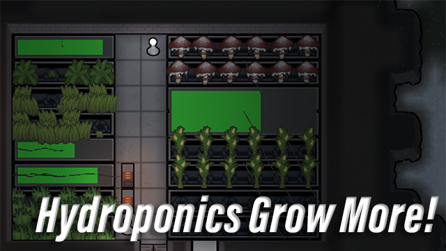

    
     
    
        Larger hydroponics provided by <a href="https://github.com/Xevion/RimWorld-Hydroponics-Expanded">Hydroponics Expanded</a>
    

 

[![badge-workshop-subscribers]][workshop-hydroponics-grow-more] [![badge-workshop-favorites]][workshop-hydroponics-grow-more] [![badge-version]][workshop-hydroponics-grow-more]

A simple patch mod to allow hydroponics basins to grow additional crops typically limited to the ground.

Currently, these crops are [Devilstrand][rimworld-devilstrand], [Haygrass][rimworld-haygrass], and [Corn][rimworld-corn].

This mod could be considered overpowered, but I'm adding it as other versions are outdated (but probably still work), and I wanted to add some extensions for my other mod, [Hydroponics Expanded][github-hydroponics-expanded].

## Compatability

If your mod adds hydroponics that properly designate themselves using the `ThingDef.building.sowTag` (as `Hydroponic`), then this patch should work with it.

If there are other patch mods modifying `ThingDef.building.sowTag`, then hope that they are not completely replacing the `sowTags` list. If they are, then load this mod AFTER their's.

## Usage

1. Install the mod.
    - Download from the Steam Workshop [here][workshop-hydroponics-grow-more].
    - Or download from the Releases tab [here][github-hydroponics-grow-more-release] & unzip the archive into your RimWorld mods folder.
2. Enable the mod in the mod menu in-game.

[workshop-hydroponics-grow-more]: https://steamcommunity.com/sharedfiles/filedetails/?id=3005440209
[github-hydroponics-grow-more-release]: https://github.com/Xevion/RimWorld-HydroponicsGrowMore/releases
[github-hydroponics-expanded]: https://github.com/Xevion/RimWorld-Hydroponics-Expanded
[rimworld-devilstrand]: https://rimworldwiki.com/wiki/Devilstrand
[rimworld-haygrass]: https://rimworldwiki.com/wiki/Haygrass
[rimworld-corn]: https://rimworldwiki.com/wiki/Corn
[badge-version]: https://img.shields.io/badge/built_for-RimWorld_1.4-blue
[badge-workshop-subscribers]: https://img.shields.io/endpoint.svg?url=https://shieldsio-steam-workshop.jross.me/3005440209/subscriptions-text
[badge-workshop-favorites]: https://img.shields.io/endpoint.svg?url=https://shieldsio-steam-workshop.jross.me/3005440209/favourites-text